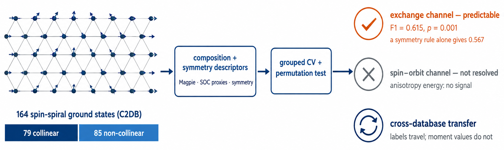

# MAG2D-NC

Machine learning of non-collinear magnetic order in two-dimensional materials,
based on the C2DB spin-spiral ground-state labels.



This repository accompanies the manuscript:

> A. Akkaya, *Learning non-collinear magnetic order in two-dimensional
> materials: an interpretable machine-learning study of the C2DB spin-spiral
> ground states*, submitted to Physica B: Condensed Matter (2026).

## Overview

Recent high-throughput spin-spiral calculations [Sødequist & Olsen, npj
Comput. Mater. **10**, 170 (2024)] showed that more than half of the predicted
2D magnets order non-collinearly. This project asks which parts of the
magnetic ground-state problem are encoded in composition and symmetry alone:

- **T1** — binary classification (collinear vs. non-collinear) on the complete
  164-material spin-spiral label set, under a pre-registered protocol with
  group-aware cross-validation and label-permutation testing.
- **T2** — four-class refinement (FM / collinear AFM / non-collinear / DM spiral).
- **T3** — regression of stored easy-axis energy differences (reported as a
  pre-committed negative result).
- **T4** — magnetic screening across three databases (C2DB, JARVIS-2D,
  2DMatPedia) with leave-one-database-out evaluation.

Tabular baselines (logistic regression, LightGBM) are compared against two
graph neural networks (a compact CGCNN reimplementation and an angle-aware
line-graph variant) under compute-matched budgets.

### Main findings

- Collinear versus non-collinear order is learnable from composition and
  symmetry alone (macro-F1 = 0.615, permutation *p* = 0.003, 75 grouped folds).
- The stable drivers are the inversion-symmetry flag and the magnetic-species
  atomic number; non-collinearity is favoured on *centrosymmetric* frustrated
  lattices rather than in the chiral subclass.
- Spin–orbit-channel quantities resist composition-level learning: the ligand
  SOC proxies are inert, and the anisotropy energy is not learnable (T3).
- Graph neural networks do not beat tabular descriptors at this data scale,
  at two orders of magnitude higher cost.
- Magnetic labels transfer across DFT protocols; moment magnitudes do not.

## Repository layout

```
notebooks/    Analysis notebooks, numbered in execution order (01-06)
scripts/      Figure generation and supplementary-table scripts
figs/         Manuscript figures and the graphical abstract
data/         Data access notes (raw databases are NOT redistributed)
results/      Per-fold results, statistics, and traceability tables (CSV/JSON)
```

## Installation

Python 3.12 is required. GPU (CUDA) is needed only for the graph-model
notebook (05).

```bash
python -m venv .venv
source .venv/bin/activate
pip install -r requirements.txt
```

## Data access

No raw database files are included in this repository:

- **C2DB** is distributed by DTU/CAMD under CC BY-NC 4.0. The bulk files
  (`c2db.db`, `c2db.tar.gz`) are provided upon request; see
  https://2dhub.org/c2db/c2db.html. Place them under `dataset/`.
- **JARVIS-2D** (`dft_2d`) and **2DMatPedia** (`twod_matpd`) are downloaded
  automatically through `jarvis-tools` (Figshare) on first run of notebook 06.

The spin-spiral ground-state labels are reconstructed from the published
tables of Sødequist & Olsen (2024) by notebook 01 and cross-validated against
the raw per-material records in the C2DB archive; see `data/README.md`.

## Reproducing the results

Run the notebooks in order:

| Notebook | Purpose | Typical runtime |
|---|---|---|
| 01 | Label reconstruction and validation | minutes |
| 02 | Structure matching and descriptor construction | minutes |
| 03 | T1 main runs, statistics, permutation test | ~2 h (CPU) |
| 04 | Interpretability, ablations, learning curves | ~2 h (CPU) |
| 05 | Graph models (CGCNN, ALIGNN-lite) | ~14 h (GPU) |
| 06 | Cross-database corpus, T4/T3/T2 | ~3 h (CPU) |

All long-running stages are checkpointed and resume automatically. Every
number reported in the manuscript is traceable to a run record via
`results/numbers_map.csv`.

Two exploratory passes preceded the reported runs. The authoritative files are
those stamped `20260809-204550` (T1 baselines, statistics, permutation test)
and `20260809-224057` (interpretability, ablations, learning curves).

## Figures and supplementary tables

```bash
python scripts/make_figures.py        # all manuscript figures, or: 02 03 04 05
python scripts/make_si_tables.py      # numeric tables of the supplementary material
```

Both read from `results/` (paths at the top of each script) and write to
`fig/`. Figure 1 is a schematic drawn in diagrams.net.

## License

The code in this repository is released under the MIT License (see
`LICENSE`). The C2DB data are licensed CC BY-NC 4.0 by DTU/CAMD and are not
redistributed here; JARVIS-2D and 2DMatPedia are subject to their own
licenses.

## Citation

If you use this code, please cite the manuscript above (see `CITATION.cff`)
together with the data sources: Sødequist & Olsen (2024) for the spin-spiral
labels, Haastrup et al. (2018) and Gjerding et al. (2021) for C2DB,
Choudhary et al. (2020) for JARVIS, and Zhou et al. (2019) for 2DMatPedia.

## Acknowledgments

The C2DB bulk data were kindly provided by DTU/CAMD.
